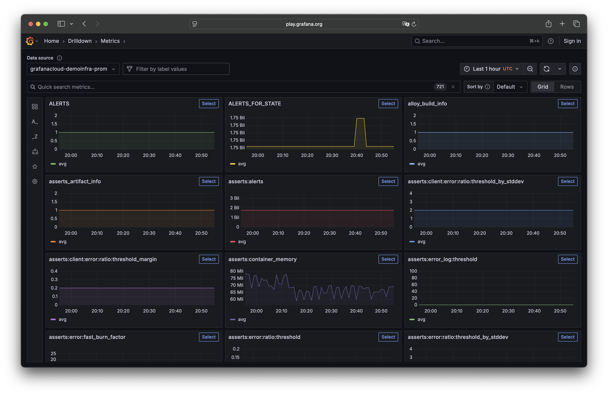

# Grafana Metrics Drilldown

The [Grafana Metrics Drilldown](https://grafana.com/docs/grafana/latest/explore/simplified-exploration/metrics) app provides a queryless experience for browsing Prometheus-compatible metrics. Quickly find related metrics without writing PromQL queries.



## Installing in your own Grafana instance

Grafana Metrics Drilldown will be preinstalled by default in all Grafana instances in the near future.

In the meantime, you can install the plugin from the `main` branch using [`grafana-cli`](https://grafana.com/docs/grafana/latest/cli/#plugins-commands):

```bash
grafana cli plugins install grafana-metricsdrilldown-app
```

## Development

### Frontend

#### Prerequisites

- [Node.js 22+](https://nodejs.org/en)
- [Docker Desktop](https://www.docker.com/products/docker-desktop/) or any alternative, like [Orbstack](https://orbstack.dev/)

#### Install dependencies

```bash
npm install
```

#### Run in watch mode

Begin by starting the Grafana server in a separate terminal:

```bash
npm run server
```

This will start the Grafana server on port 3001. If you'd like to use a different port, follow the instructions in the [Configuration](#configuration) section below.

Then, run the plugin in watch mode:

```bash
npm run dev
```

You can now visit `http://localhost:3001/a/grafana-metricsdrilldown-app` to use the local version of the Grafana Metrics Drilldown app.

#### Running tests

##### Unit tests

```bash
# Runs the tests and watches for changes
npm run tdd

# Exits after running all the tests and compute code coverage
npm run test
```

##### End-to-end tests

Please check our [end to end testing documentation](./docs/end-to-end-testing.md) for setup and guidelines.

#### Run the linter

To see lint errors, run:

```bash
npm run lint
```

To fix lint errors automatically, run:

```bash
npm run lint:fix
```

### Configuration

If you'd like to customize the exposed port of the Grafana instance that is used for development (created with `npm run server`), you can do so by setting the `GRAFANA_PORT` environment variable in the `.env` file. For reference, see `.env.example`.

```bash
# .env
GRAFANA_PORT=3001
```
